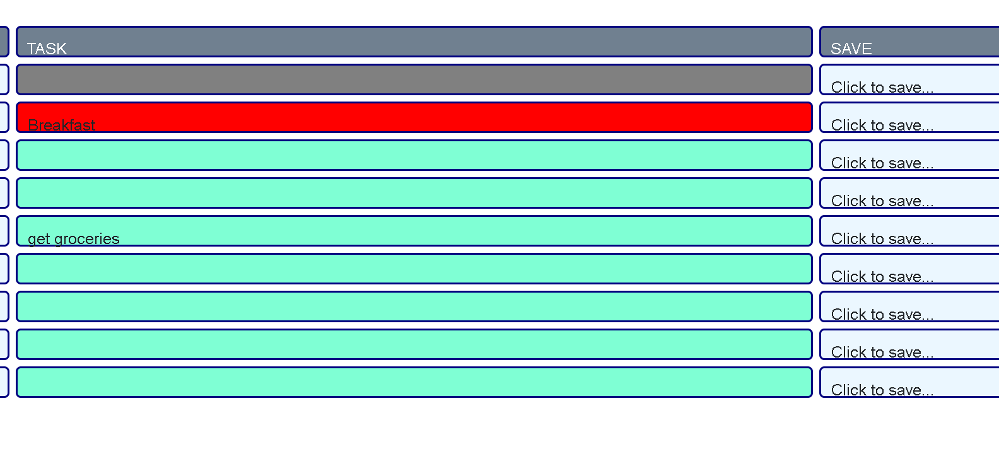

# 05-work-day-scheduler
assignment 5 for bootcamp


## Our Goal:
Make a day Planner through `jquery` and `moment()` so that we can track the events that happen by the hour.

```md
GIVEN I am using a daily planner to create a schedule
WHEN I open the planner
THEN the current day is displayed at the top of the calendar
WHEN I scroll down
THEN I am presented with timeblocks for standard business hours
WHEN I view the timeblocks for that day
THEN each timeblock is color coded to indicate whether it is in the past, present, or future
WHEN I click into a timeblock
THEN I can enter an event
WHEN I click the save button for that timeblock
THEN the text for that event is saved in local storage
WHEN I refresh the page
THEN the saved events persist
```

## Mock Up

My page displays the current time and date, changing elements based on the time gathered from `moment()`.  

The current time slot will be displayed with a red background, upcoming time slots will be displayed with an aquamarine background, and past times will be displayed with a gray background.

Through bootstrap, I was able to easily set the column sizes to fit the screen as I wish.


When the user types an entry into the task section of a time slot, they may click on the time slot's save button to save their information in local storage, which will keep their information there on page refresh.



## Links

`My GitHub`: https://github.com/KIMOISQUIGGLES/05-work-day-scheduler

`My Webpage`: https://kimoisquiggles.github.io/05-work-day-scheduler/

